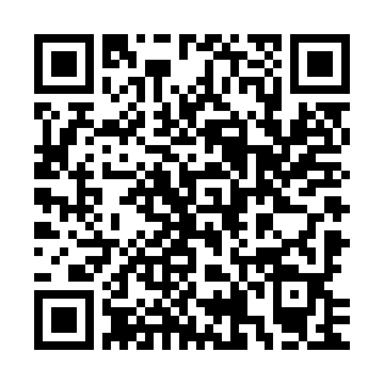

# Model Kit

A gunpla-style model building game for the Nintendo 3DS. Snip parts off the
runner, file the nubs down and click them together — twenty kits, built on the
bottom screen with the stylus.

Homebrew, written in C against devkitARM, citro3d and citro2d.

## Install

Scan the **QR code at the bottom of this page** with **FBI → Remote Install →
Scan QR Code** and the console downloads and installs it on its own.

Or download [`modelkit0.4.6.cia`](https://github.com/stevenjc2009-byte/model-game/releases/download/v0.4.6/modelkit0.4.6.cia)
and install it with FBI the usual way.

**Requirements**

- A 3DS, 2DS, New 3DS or New 2DS running custom firmware (Luma3DS) with
  signature patches. Unsigned titles will not install without them.
- Aim the **rear** camera at the code from roughly nine inches away. The 3DS
  camera is fixed focus, so distance matters more than lighting.

## Updating

Once installed the game can update itself. **Options → Check for Update** asks
GitHub whether a newer release exists; if one does, tapping **Download** fetches
it, installs it over the current version and restarts the game into the new
build. Nothing is written to the SD card along the way, so no free space is
needed beyond what the title itself takes.

The updater needs wifi. It will say so on the top screen if it cannot get out.

## Building from source

Requires devkitPro with `devkitARM`, `libctru`, `citro3d`, `citro2d`, and these
portlibs for the updater's HTTPS support:

```bash
dkp-pacman -S 3ds-curl 3ds-mbedtls
```

Then, from a devkitPro MSYS2 shell:

```bash
make
```

`make` produces `modelkit.3dsx` for the Homebrew Launcher. The installable title
is a separate step, because it takes a second toolchain pass:

```bash
make cia
```

`romfs/cacert.pem` is the Mozilla CA bundle and is a required build input — the
console's own certificate store is too old to verify github.com, so without it
the update check fails. Refresh it from <https://curl.se/ca/cacert.pem>.

## Releasing

The updater compares GitHub's newest release tag against `MODELKIT_VERSION` in
[`source/updater.h`](source/updater.h). Tags may be written `v0.2.1` or `0.2.1`;
the comparison strips a leading `v`.

`MODELKIT_VERSION` is blank between releases on purpose. While it is blank the
update check reports that the build has no version rather than guessing, so
filling it in is step one of cutting any release.

Attach **one CIA** to each release, named `modelkit<version>.cia` — e.g.
`modelkit0.3.cia`. The QR code on this branch points straight at it, and the
in-app updater reads the real download URL out of the API response, so it takes
whatever `.cia` the release carries whatever it is called.

A second fixed-name copy used to be attached as well, to keep
`/releases/latest/download/modelkit.cia` resolving. It is not attached any more:
no release before v0.3 ever used that name, so nothing was holding such a link.

`docs/install-qr.png` is regenerated per release and encodes that release's own
versioned URL, so each branch's README installs the version that branch is.
Generate it with error correction **L** — the 3DS camera is 640x480 and fixed
focus, so fewer, fatter modules scan far better than heavy redundancy — and
always decode the image back and compare it against the URL before shipping it.
A QR pointing at the wrong release looks identical to a right one.

## Licence

See [LICENSE](LICENSE).

## Install QR code

Aim the **rear** camera at this from roughly nine inches away, in
**FBI → Remote Install → Scan QR Code**:



Installs **v0.4.6**.
